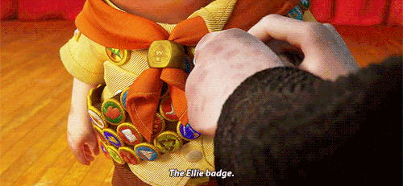

    

    

 

Like you, I'm just a wandering soul on this planet we call Earth... oh, I'm also a computer engineering student at Faculty of Engineering, UNAM. I live in Mexico City and I'm very passionate about new technologies, operating systems, electronics, cybersecurity, project management and automation.

 

<h3 align="center">🌟 About me 🌟</h3>

    

- 🌱 I’m currently learning about Cloud Cybersecurity, CAD software, intermediate german and IOT.
- 👯 I’m looking to collaborate on engineering projects along with other types of engineering students (electrical, aerospace, biomedical systems, etc).
- 🤔 I’m looking for help with dealing with post-end-of-semester PTSD.
- 💬 Ask me about my music taste, anime, videogames, workout routines, etc.
- 😄 Pronouns: he/him.
- ⚡ Fun fact: I do a LOT of intense cardio: at least 1 hour a day, 6 days a week. Don't try to outrun me on long distances, you'll lose.

 

<h3 align="center">💬 Languages 💬</h3>

    

* 🇲🇽 Spanish (Native) 🇪🇸
* 🇬🇧 English (C1) 🇺🇸
* 🇩🇪 German (A2) 🇦🇹
* 🇮🇹 Italian (A1) 🇮🇹

 

<h3 align="center">🥇 Certifications 🥇</h3>

    

* [AZ 900](https://www.credly.com/badges/f770b36d-fab4-4241-bce6-14bf0c4c92b4/public_url) (Microsoft Azure Fundamentals)
* FCE (English Certification): C1 level

 

<h3 align="center">⌨️ Languages and Tools 🖱️</h3>

    

##### 🧑‍💻 Programming Languages 🧑‍💻
- C, C++, C#, Python, JavaScript, Java, Kotlin, R, MatLab
##### 🌐 Web Development 🌐
- HTML, CSS, JavaScript, Bootstrap
##### 📱 Mobile Development 📱
- Android Studio, Kotlin
##### 🤖 Embedded Systems🤖
- Arduino, Raspberry Pi
##### 📜 Scripting Languages 📜
- Bash, PowerShell
##### 🐱 Version Control 🐱
- Git, GitHub
##### 📔 Databases 
- Oracle SQL, PostgreSQL
##### ☁️ Cloud Platforms ☁️
- Microsoft Azure, AWS (Amazon Web Services)
##### 📈 Data Analysis and Visualization 📈
- Excel, MatLab, R
##### 📝 Text Formatting 📝
- Markdown, LaTeX
##### 🤝 Collaboration Tools 🤝
- GitHub, Jira, Kanban, Slack, etc
#### 🖥️ Networking 🖥️
- Cisco Packet Tracer
##### 💡 Other 💡
- Linux, Windows, Microsoft Office, Google Workspace, etc

 

<h3 align="center">📊 Stats 📊</h3>

&nbsp;

 

<h3 align="center">🏆 GitHub Trophies 🏆</h3> 

  

 

<h3 align="center">📫 Contact 📫</h3>

    

* [Telegram](https://t.me/EithanUwU) (best option)
* [Instagram](https://www.instagram.com/_nahtieithan_/) 
* [Mail](mailto:eithantrevino@gmail.com)

 

<h3 align="center">🤝 Support 🤝</h3>

    

  

